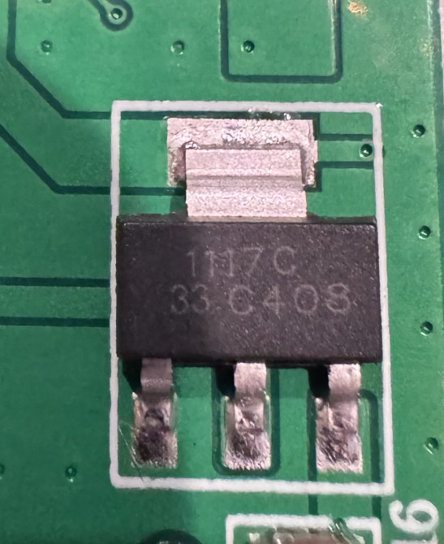

# 1000Mbps 1 in 4 Out Ethernet Adapter 1 to 2/3/4 RJ45 LAN Internet Splitter Cat 6 RJ45 Gigabit Switch for PC Laptop TV Box Router

Bought on aliexpress here: [https://www.aliexpress.us/item/3256807924363160.html?spm=a2g0o.order_list.order_list_main.35.43c11802scOiFw&gatewayAdapt=glo2usa](https://www.aliexpress.us/item/3256807924363160.html?spm=a2g0o.order_list.order_list_main.35.43c11802scOiFw&gatewayAdapt=glo2usa)

# VERDICT

# Basic info

# Internals

Chips:

- FT24C128A 4A3GKJ
  - [datasheet](https://www.lcsc.com/datasheet/lcsc_datasheet_1912111437_FMD-Fremont-Micro-Devices-FT24C128A-ETR-B_C417370.pdf)

- 1117C 33C408
  - [datasheet](https://www.ti.com/lit/ds/symlink/lm1117.pdf) 

- RTL8367S
  - [datasheet (kinda?)](https://www.realtek.com/Product/Index?id=3699)

Front:

Back:

### Files