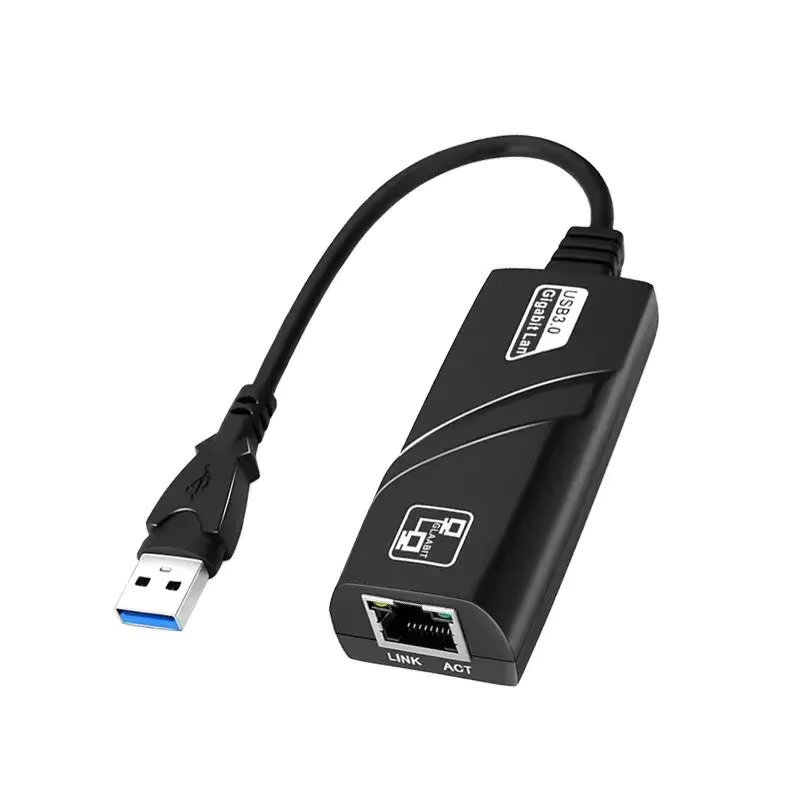
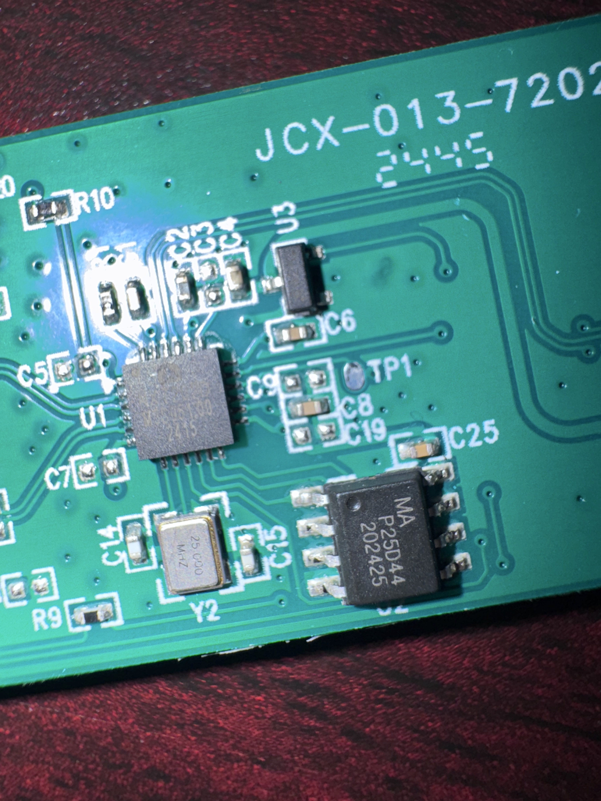
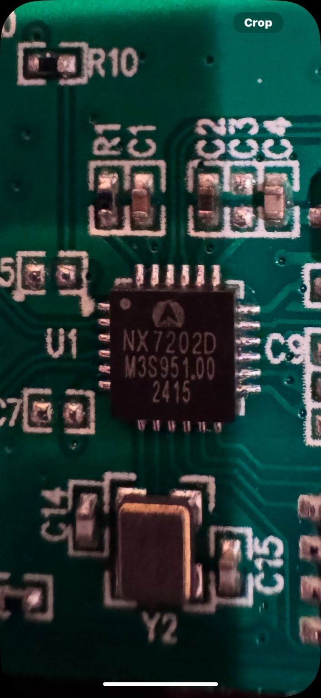
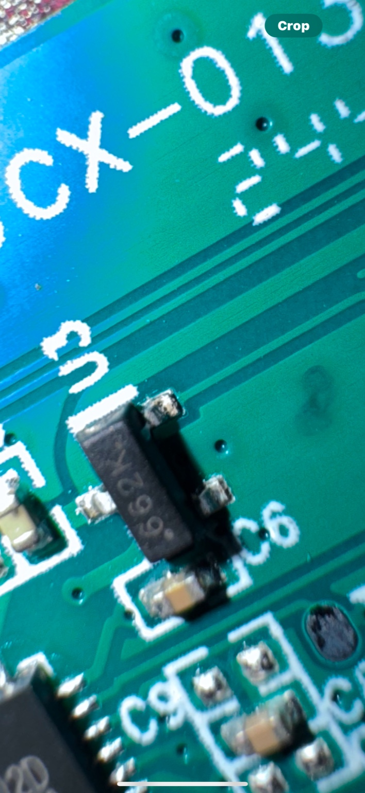
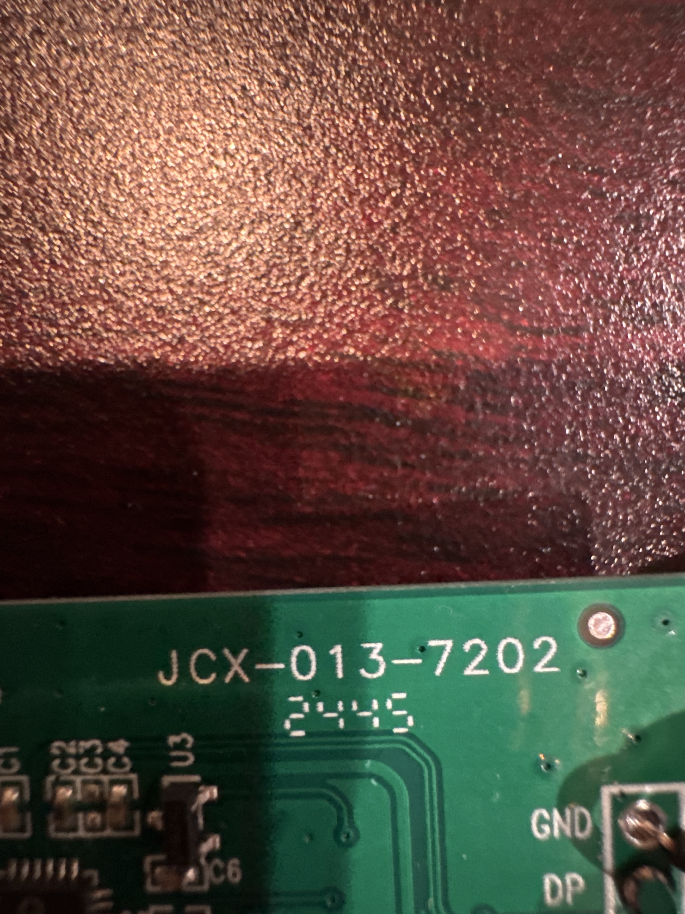

# 100/1000Mbps USB 3.0 Wired USB TypeC To Rj45 Lan Ethernet Adapter RTL8153 Network Card for PC Macbook Windows Laptop



Bought on Aliexpress here: [https://www.aliexpress.us/item/3256806941075115.html?spm=a2g0o.order_list.order_list_main.5.39ca1802aVhvC9&gatewayAdapt=glo2usa](https://www.aliexpress.us/item/3256806941075115.html?spm=a2g0o.order_list.order_list_main.5.39ca1802aVhvC9&gatewayAdapt=glo2usa)

### VERDICT

It IS NOT malicious. It is mostly just poor coding practices from an earlier time. It behaves the same as a lot of malware, but it has nothing overtly malicious in it.

---

### Basic info

File contains an `AUTORUN.INF` file that attempts to take advantage of autorun on Windows. This has not worked since Windows 7 and needs to be manually enabled to run.

Tree of contents with the `AUTORUN.INF` file:
```
.
├── AUTORUN.INF
├── ControlI.dat
├── FW.bin
├── NX7202.ico
└── Setup_exe.bin
```

Once the file runs it runs a file called `Setup.exe`. This file contains a section named `_winzip` and is labeled as "malicious" by Malcore AI. See here: [https://app.malcore.io/share/637b72e6d2815d7e836350da/6793bdabcaee9eac363bf430](https://app.malcore.io/share/637b72e6d2815d7e836350da/6793bdabcaee9eac363bf430). It is labeled as malicious due to behavior as it acts a lot like a malicious file would.

The file works the following way:
1. You plug in the adapter
2. Autorun tries to run (earleir versions it would run)
3. It runs an EXE that has a _winzip_ section in it
4. That exe unzips itself as a zip file and runs a .bat file called nx_install.bat
5. That bat file copies the exe file inside the zip called install.exe to nxinstall.exe
6. nxinstall.exe installs all the drivers for the usb to run the ethernet
7. nxinstall.exe deletes the original install.exe file

Tree of unzipped files:
```
.
├── install_exe.bin
├── netusbmini.inf
├── netusbmini.sys
├── netusbmini64.cat
├── netusbmini64.sys
├── netusbmini_cat.bin
├── nodata.txt
├── nxinstall_bat.txt
├── nxnetwdm.cat
├── nxnetwdm.inf
├── nxnetwdm.sys
├── nxnetwdm64.cat
└── nxnetwdm64.sys
```

### Internals

Chips:

- MA P25Q4 202425 -- flash memory
  - [datasheet](https://www.alldatasheet.com/datasheet-pdf/pdf/1150759/PUYA/P25Q40H.html)



- NX7202D M3S951.00 -- micro controller
  - Cannot locate a datasheet



- 662K -- transistor
  - [possible datasheets](https://www.alldatasheet.com/view.jsp?Searchword=76299&sField=3)


Full front:


Full back:


Board info:

- JCX-013-7202 -- generic PCB board
  - No datasheets most likely Sanyo product

### File scans

`Setup.exe`:
- Full analysis: [https://app.malcore.io/share/637b72e6d2815d7e836350da/6793bda9caee9eac363bf3d3](https://app.malcore.io/share/637b72e6d2815d7e836350da/6793bda9caee9eac363bf3d3)
- AI: [https://app.malcore.io/share/637b72e6d2815d7e836350da/6793bdabcaee9eac363bf430](https://app.malcore.io/share/637b72e6d2815d7e836350da/6793bdabcaee9eac363bf430)
- Exif: [https://app.malcore.io/share/637b72e6d2815d7e836350da/6793bdaccaee9eac363bf45d](https://app.malcore.io/share/637b72e6d2815d7e836350da/6793bdaccaee9eac363bf45d)
- Dynamic: [https://app.malcore.io/share/637b72e6d2815d7e836350da/6793bdaef4b96e162b80a6b0](https://app.malcore.io/share/637b72e6d2815d7e836350da/6793bdaef4b96e162b80a6b0)
- Yara: [https://app.malcore.io/share/637b72e6d2815d7e836350da/6793bdaff4b96e162b80a6cf](https://app.malcore.io/share/637b72e6d2815d7e836350da/6793bdaff4b96e162b80a6cf)

`install.exe`:
- Full analysis: [https://app.malcore.io/share/637b72e6d2815d7e836350da/6793c3a7da3e8886f5c6defa](https://app.malcore.io/share/637b72e6d2815d7e836350da/6793c3a7da3e8886f5c6defa)
- AI: [https://app.malcore.io/share/637b72e6d2815d7e836350da/6793c3a9da3e8886f5c6df42](https://app.malcore.io/share/637b72e6d2815d7e836350da/6793c3a9da3e8886f5c6df42)
- Exif: [https://app.malcore.io/share/637b72e6d2815d7e836350da/6793c3aa292fee4c5ea35548](https://app.malcore.io/share/637b72e6d2815d7e836350da/6793c3aa292fee4c5ea35548)
- Dynamic: [https://app.malcore.io/share/637b72e6d2815d7e836350da/6793c3abda3e8886f5c6df85](https://app.malcore.io/share/637b72e6d2815d7e836350da/6793c3abda3e8886f5c6df85)
- Yara: [https://app.malcore.io/share/637b72e6d2815d7e836350da/6793c3adcaee9eac363c0060](https://app.malcore.io/share/637b72e6d2815d7e836350da/6793c3adcaee9eac363c0060)

### File hashes
```
b15624d7189c1426b21dd7f3b3edda6b20bf856d88087a6b4c5aa67d3b08e31b  ./AUTORUN.INF
8e96bfbc7be083c30b36e7ac55cf3ff198f84908106089abf602b014497a31ba  ./ControlI.dat
3dbb1ea853cdf0653719ce300540878c8bee51dc5a69061dcaa9abd510c20443  ./FW.bin
dc040f1eaf8c1f3e711ce2c70c1c77f3d0bece7f10ce4e7ddabc11834b16f13f  ./NX7202.ico
10b4dd20f03ad951380cfff74d108103dd4179225afe59bf4c8099832811a2de  ./Setup/install_exe.bin
a235a76c38bb67e25d6f21ddfd065e69976efc151dd470ba9f2aea7d558f9851  ./Setup/netusbmini.inf
17b563e079a4256b420d17dfc110f714b2b039a36d364655ceb802b980b9fa3d  ./Setup/netusbmini.sys
24396c631e003f8c28c88f32625792f414ee575e7a031c3ff56719a987df177c  ./Setup/netusbmini64.cat
e0f0075db00798786a318c0d3cf56f850b5383648da22c1720ae1b026f1a5534  ./Setup/netusbmini64.sys
bb739b757447b567909384138a5d4bd06fcbdcacb47cc90553b32c10984ae331  ./Setup/netusbmini_cat.bin
2a5048935324b55861433d4fa98be1ef37eb712f9ec8173878c96615cb219cf0  ./Setup/nodata.txt
6adecd420c3aecb0c2e54ad7d632defca9263cbcd1e9558dd2ea02cadb7277e1  ./Setup/nxinstall_bat.txt
1c0d29199d752be45822994b031688bdb8215f9ad4d216ffeb66692c8410c6ee  ./Setup/nxnetwdm.cat
bbf6b83a16e30f1caf7c9990897c472e05a7507cffdfbd15c652f12a815a5765  ./Setup/nxnetwdm.inf
86454c8954e27cc58f99705dfde987c6820983d311f9ffecf19946d1f5493adc  ./Setup/nxnetwdm.sys
d04211809b1b1f4cf6965561cca6d2cd6209ca0c33bc94e755e3d17b3c8b0c76  ./Setup/nxnetwdm64.cat
90ea7032f075047bdb3b43f0b82fa9e695a1b69e29a7c7027664d7432a814ad3  ./Setup/nxnetwdm64.sys
dabd66200d76616a55757ac89fdb1b58cd236e701eb3adcc1dc3427a84f68060  ./Setup_exe.bin
```

### File info

`Setup.exe`:
Function list:
```
0x0040a79e   28    430 entry0
0x004055de   51   1235 main
0x004062dd   14    236 fcn.004062dd
0x004073b8    3     56 fcn.004073b8
0x00407211    3     38 fcn.00407211
0x004071a2   14    111 fcn.004071a2
0x00407390    3     40 fcn.00407390
0x00407338    4     88 fcn.00407338
0x0040725d    4    110 fcn.0040725d
0x00407237    3     38 fcn.00407237
0x00402018   12    430 fcn.00402018
0x004072cb    6    109 fcn.004072cb
0x00408b96    6    275 fcn.00408b96
0x0040e919    1      8 fcn.0040e919
0x00408c5d    1     14 fcn.00408c5d
0x00408c27    3     54 fcn.00408c27
0x00408ba5   11    130 fcn.00408ba5
0x0040119e    1     25 fcn.0040119e
0x0040118d    4     17 fcn.0040118d
0x00401175    3     24 fcn.00401175
0x00401226    4     25 fcn.00401226
0x00408c6b   16    113 fcn.00408c6b
0x00401000    4     19 section..text
0x0040123f    9     92 fcn.0040123f
0x0040129b    8    111 fcn.0040129b
0x00401450    1     58 fcn.00401450
0x00401576    5     33 fcn.00401576
0x004011e8    8     62 fcn.004011e8
0x004015e9    3     19 fcn.004015e9
0x004091a7   13    101 fcn.004091a7
0x00401379    3     51 fcn.00401379
0x00409100   14    139 fcn.00409100
0x00401716   11    227 fcn.00401716
0x004021f6   33    436 fcn.004021f6
0x0040918b    1     28 fcn.0040918b
0x0040be56   12    134 fcn.0040be56
0x0040894c    1     18 fcn.0040894c
0x004089c8    4     37 fcn.004089c8
0x00409e5d    1      5 fcn.00409e5d
0x00401563    1     19 fcn.00401563
0x004017f9    9    149 fcn.004017f9
0x0040188e   30   1126 fcn.0040188e
0x00408cdc    9    173 fcn.00408cdc
0x004095d8    1     51 fcn.004095d8
0x00406c3b    5    110 fcn.00406c3b
0x0040873f   22    250 fcn.0040873f
0x004064f0    1     27 fcn.004064f0
0x0040960b    1     54 fcn.0040960b
0x00405edf    8     62 fcn.00405edf
0x00409677    1     20 fcn.00409677
0x00408888   21    196 fcn.00408888
0x0040134e    6     43 fcn.0040134e
0x00402515   27    285 fcn.00402515
0x004070e4    3    135 fcn.004070e4
0x00406e1d   43    711 fcn.00406e1d
0x004066af    1     51 fcn.004066af
0x00401013    1     30 fcn.00401013
0x00406657    1     88 fcn.00406657
0x00401539    1     42 fcn.00401539
0x004013ac    7     89 fcn.004013ac
0x0040143e    1     18 fcn.0040143e
0x00402d34    6    113 fcn.00402d34
0x00401fb1    4     41 fcn.00401fb1
0x00402da5    4     45 fcn.00402da5
0x004031d4   22    240 fcn.004031d4
0x004023d4    1     17 fcn.004023d4
0x00408985    4     67 fcn.00408985
0x0040895e    3     39 fcn.0040895e
0x004015b3    5     54 fcn.004015b3
0x004021c6    1     48 fcn.004021c6
0x004096b0    4     43 fcn.004096b0
0x00402632   44    853 fcn.00402632
0x00408544    7    102 fcn.00408544
0x004034f2    8     98 fcn.004034f2
0x0040969a    3     22 fcn.0040969a
0x004011b7    6     49 fcn.004011b7
0x004097cb    8     92 fcn.004097cb
0x004038b5   24    487 fcn.004038b5
0x004085aa    1     26 fcn.004085aa
0x004085c4    1     88 fcn.004085c4
0x00401597    3     28 fcn.00401597
0x004024bf    3     86 fcn.004024bf
0x00403406   17    236 fcn.00403406
0x00403554   14    508 fcn.00403554
0x00403bd8   22    280 fcn.00403bd8
0x004023aa    1     42 fcn.004023aa
0x00408839    6     79 fcn.00408839
0x004032c4   10    130 fcn.004032c4
0x004031ad    1     39 fcn.004031ad
0x004023e5   11    218 fcn.004023e5
0x004042ab    6    136 fcn.004042ab
0x00404175   15    269 fcn.00404175
0x00404126    5     79 fcn.00404126
0x0040148a   16    175 fcn.0040148a
0x0040130a    1     31 fcn.0040130a
0x00404282    3     41 fcn.00404282
0x00402e76   27    436 fcn.00402e76
0x00402987   64    941 fcn.00402987
0x0040302a   21    387 fcn.0040302a
0x00403cf0   16    228 fcn.00403cf0
0x004086da    7    101 fcn.004086da
0x00404333   25    395 fcn.00404333
0x0040920c    1      5 fcn.0040920c
0x004044be   46   1014 fcn.004044be
0x004048b4    5    129 fcn.004048b4
0x00403dd4    3     66 fcn.00403dd4
0x00409828   10    123 fcn.00409828
0x00404935   21    305 fcn.00404935
0x00403a9c   15    316 fcn.00403a9c
0x00403e16    3    125 fcn.00403e16
0x00401fda    3     62 fcn.00401fda
0x00404a66   12    235 fcn.00404a66
0x00401405    3     57 fcn.00401405
0x00402dd2    7    164 fcn.00402dd2
0x004010a9   16    204 fcn.004010a9
0x004015fc    5    122 fcn.004015fc
0x00403e93   41    659 fcn.00403e93
0x00401676   12    160 fcn.00401676
0x004098a3   26    179 fcn.004098a3
0x00407676    1     85 fcn.00407676
0x00403750   30    357 fcn.00403750
0x00401f55   11     92 fcn.00401f55
0x00409b3c   23    195 fcn.00409b3c
0x00405ab1    1    111 fcn.00405ab1
0x00409bff   10    133 fcn.00409bff
0x00409c8d    9     50 fcn.00409c8d
0x00405b63    4     23 fcn.00405b63
0x00409a8c    7     34 fcn.00409a8c
0x00409aae    9     63 fcn.00409aae
0x00409d6c    1     14 fcn.00409d6c
0x00409cbf   14    173 fcn.00409cbf
0x0040601c   15    180 fcn.0040601c
0x00405b20    6     67 fcn.00405b20
0x00405f1d   14     89 fcn.00405f1d
0x004060d0    7     62 fcn.004060d0
0x00405f76   13    166 fcn.00405f76
0x00409e62   13    108 fcn.00409e62
0x00405e83    5     49 fcn.00405e83
0x00405eb4    5     43 fcn.00405eb4
0x00405e4f    3     52 fcn.00405e4f
0x00409ece   26    201 fcn.00409ece
0x00405caa   20    203 fcn.00405caa
0x00405e29    3     38 fcn.00405e29
0x00405d8d   11    156 fcn.00405d8d
0x00409f97   49    524 fcn.00409f97
0x00405c86    5     36 fcn.00405c86
0x004061b7   16    224 fcn.004061b7
0x00406511   14    121 fcn.00406511
0x0040659b    1     23 fcn.0040659b
0x004065c0   10    146 fcn.004065c0
0x004067de   20    237 fcn.004067de
0x0040a1b2    8     53 fcn.0040a1b2
0x0040658a    1     17 fcn.0040658a
0x0040694f   15    212 fcn.0040694f
0x00406461    8    143 fcn.00406461
0x00406a23   14    226 fcn.00406a23
0x004068cb    8    132 fcn.004068cb
0x00405d75    4     20 fcn.00405d75
0x004063c9   11    152 fcn.004063c9
0x00406b05    4     73 fcn.00406b05
0x00406b4e    1     21 fcn.00406b4e
0x00405b7a    8    133 fcn.00405b7a
0x00405bff    3     21 fcn.00405bff
0x00406b63    4     26 fcn.00406b63
0x00409641    1     54 fcn.00409641
0x00406297   11     70 fcn.00406297
0x00405c61    5     37 fcn.00405c61
0x0040676a    8    116 fcn.0040676a
0x00406ca9    1     53 fcn.00406ca9
0x00406b7d   14    190 fcn.00406b7d
0x00405c45    4     28 fcn.00405c45
0x00405c14    4     49 fcn.00405c14
0x0040968b    1     15 fcn.0040968b
0x0040674b    5     31 fcn.0040674b
0x0040610e   19    169 fcn.0040610e
0x00406cde   24    319 fcn.00406cde
0x004066e2    7     59 fcn.004066e2
0x0040671d    6     46 fcn.0040671d
0x0040716b    7     55 fcn.0040716b
0x00401cf4    9    205 fcn.00401cf4
0x00401329    4     37 fcn.00401329
0x004076cb    9    102 fcn.004076cb
0x00407afa    5     32 fcn.00407afa
0x0040a26e    1      5 fcn.0040a26e
0x0040e4b2    4     34 fcn.0040e4b2
0x0040b352   10    110 fcn.0040b352
0x00409dda    1     25 fcn.00409dda
0x0040a356    1     24 fcn.0040a356
0x00409a7a    1     18 fcn.00409a7a
0x00409a3e    1     54 fcn.00409a3e
0x0040d264    1     69 fcn.0040d264
0x0040cfa6    1      9 fcn.0040cfa6
0x0040d6ea    4     49 fcn.0040d6ea
0x0040d627   13    186 fcn.0040d627
0x0040cf47    1     36 fcn.0040cf47
0x0040e46f    5     57 fcn.0040e46f
0x0040e2cf   27    416 fcn.0040e2cf
0x00409956   13    185 fcn.00409956
0x00409a74    1      6 fcn.00409a74
0x0040cfaf    1      9 fcn.0040cfaf
0x0040d612    1     21 fcn.0040d612
0x0040d2a9    1     20 fcn.0040d2a9
0x0040a36e    7     88 fcn.0040a36e
0x0040a224    4     70 fcn.0040a224
0x00407b1a    5     49 fcn.00407b1a
0x00407b4b   75   1019 fcn.00407b4b
0x00407731   47    715 fcn.00407731
0x00408459  123   1788 fcn.00408459
0x0040861c    4     56 fcn.0040861c
0x00403346   11    192 fcn.00403346
0x00408654    9    134 fcn.00408654
0x0040a280   21    135 fcn.0040a280
0x00405d89    1      4 fcn.00405d89
0x004065b2    1     14 fcn.004065b2
0x00409df3    7    106 fcn.00409df3
0x0040a3c6    3     22 fcn.0040a3c6
0x0040b56e    3     24 fcn.0040b56e
0x0040b4f7    6    119 fcn.0040b4f7
0x0040b1f9    7    106 fcn.0040b1f9
0x0040aaba   13    152 fcn.0040aaba
0x0040b8e8    3     19 fcn.0040b8e8
0x0040a535    3     36 fcn.0040a535
0x00412c60    1      6 sub.KERNEL32.dll_RtlUnwind
0x0040ba63    2     48 fcn.0040ba63
0x0040b991    8    132 fcn.0040b991
0x0040ba41    2     31 fcn.0040ba41
0x0040ca82   20    228 fcn.0040ca82
0x00409248    1     82 fcn.00409248
0x00409300    7    213 fcn.00409300
0x0040cbb2    4     48 fcn.0040cbb2
0x0040cc00    3     76 fcn.0040cc00
0x0040ba38    1      9 fcn.0040ba38
0x0040cd70   16     97 fcn.0040cd70
0x0040cc4c   20    279 fcn.0040cc4c
0x004096db   20    240 fcn.004096db
0x0040cea4   10    146 fcn.0040cea4
0x0040ce59    8     75 fcn.0040ce59
0x0040b2db   10    110 fcn.0040b2db
0x0040ce11    7     72 fcn.0040ce11
0x0040df37   65    739 fcn.0040df37
0x00409b33    1      9 fcn.00409b33
0x0040cf91    1     20 fcn.0040cf91
0x0040cf6b    4     38 fcn.0040cf6b
0x00409aed    3     70 fcn.00409aed
0x0040d763    6     43 fcn.0040d763
0x0040d78e   50    788 fcn.0040d78e
0x00409c55    1      9 fcn.00409c55
0x0040b8ad    7     59 fcn.0040b8ad
0x0040b82b    9    130 fcn.0040b82b
0x0040e735    3     64 fcn.0040e735
0x0040e4d4   61    609 fcn.0040e4d4
0x0040e7ac    8    103 fcn.0040e7ac
0x0040e813    1      9 fcn.0040e813
0x00409d95    1     14 fcn.00409d95
0x0040dc58   54    735 fcn.0040dc58
0x0040a0db    1      9 fcn.0040a0db
0x0040a559    3     36 fcn.0040a559
0x0040a57d    6     65 fcn.0040a57d
0x0040e275    6     90 fcn.0040e275
0x0040b6a7   17    388 fcn.0040b6a7
0x0040b3fb   16    146 fcn.0040b3fb
0x0040d217    1     76 fcn.0040d217
0x0040b349    1      9 fcn.0040b349
0x0040e4a8    1     10 fcn.0040e4a8
0x004119ef    1     10 fcn.004119ef
0x0040a42f    1     10 fcn.0040a42f
0x0040e90f    1     10 fcn.0040e90f
0x004119e5    1     10 fcn.004119e5
0x004117db    1     25 fcn.004117db
0x0040e96c    1      1 fcn.0040e96c
0x0040cbe9    1     17 fcn.0040cbe9
0x0040d574    7     73 fcn.0040d574
0x0040b438    6    182 fcn.0040b438
0x0040f1c9    5     36 fcn.0040f1c9
0x0040ef89   47    562 fcn.0040ef89
0x0040ee54   29    309 fcn.0040ee54
0x0040ed9b   12    185 fcn.0040ed9b
0x0040eb28   21    219 fcn.0040eb28
0x0040d063   13    146 fcn.0040d063
0x0040eacb   16     93 fcn.0040eacb
0x0040d1d7    1     17 fcn.0040d1d7
0x0040d0f5   14    226 fcn.0040d0f5
0x0040d1f9    1     15 fcn.0040d1f9
0x0040e96d   39    350 fcn.0040e96d
0x0040d1e8    1     17 fcn.0040d1e8
0x0040d208    1     15 fcn.0040d208
0x0040f211    9    148 fcn.0040f211
0x0040f842    3     64 fcn.0040f842
0x0040f68a   38    440 fcn.0040f68a
0x0040f647    3     67 fcn.0040f647
0x0040f2a5   85    930 fcn.0040f2a5
0x0040ab55    1      9 fcn.0040ab55
0x0040ab5e   12    122 fcn.0040ab5e
0x0040a8db    5     85 fcn.0040a8db
0x0040a8ac    9     47 fcn.0040a8ac
0x0040a930   26    394 fcn.0040a930
0x0040cdd1    7     64 fcn.0040cdd1
0x0040abd8   37    473 fcn.0040abd8
0x0040af12    1      9 fcn.0040af12
0x0040adb1   27    399 fcn.0040adb1
0x0040fa52   16    137 fcn.0040fa52
0x0040fa12    8     64 fcn.0040fa12
0x0040f882    3    400 fcn.0040f882
0x0040b0a9   17    134 fcn.0040b0a9
0x0040b12f   19    140 fcn.0040b12f
0x0040af69   28    320 fcn.0040af69
0x0040b1bb    9     62 fcn.0040b1bb
0x0040b263    1     12 fcn.0040b263
0x0040d027    4     60 fcn.0040d027
0x0040b26f    9    108 fcn.0040b26f
0x0040b4ee    1      9 fcn.0040b4ee
0x0040b3c9    3     50 fcn.0040b3c9
0x0040b692    1      9 fcn.0040b692
0x0040b69e    1      9 fcn.0040b69e
0x0040fd94    3     62 fcn.0040fd94
0x0040fb70   51    548 fcn.0040fb70
0x0040b8fb    3     19 fcn.0040b8fb
0x0040ba60    1      3 fcn.0040ba60
0x0040baae    3    129 fcn.0040baae
0x0040bb35    9    227 fcn.0040bb35
0x0040fe22    7     96 fcn.0040fe22
0x00410910    3     45 fcn.00410910
0x0041076f    1      6 fcn.0041076f
0x00410711    6     94 fcn.00410711
0x004106cd    4     68 fcn.004106cd
0x004105f1   12    210 fcn.004105f1
0x0040ff12   13    271 fcn.0040ff12
0x0040bc2c   31    352 fcn.0040bc2c
0x0040bd8c   16    202 fcn.0040bd8c
0x0040bf65    6     68 fcn.0040bf65
0x0040c06f    3     27 fcn.0040c06f
0x00409241    1      7 fcn.00409241
0x0040bf09   13     92 fcn.0040bf09
0x0040cb9f    3     19 fcn.0040cb9f
0x004094e5    1     40 fcn.004094e5
0x0040957a    1     94 fcn.0040957a
0x0040c08a    8     69 fcn.0040c08a
0x0040bfa9   15    166 fcn.0040bfa9
0x0040c330   10    118 fcn.0040c330
0x0040952e    8     76 fcn.0040952e
0x0040950d    6     33 fcn.0040950d
0x0040c0cf    6     67 fcn.0040c0cf
0x004115d6    3     13 fcn.004115d6
0x0040c123    3     37 fcn.0040c123
0x00408d90   37    418 fcn.00408d90
0x0040c3a6   29    371 fcn.0040c3a6
0x0040c525    8    133 fcn.0040c525
0x0040c20a    2    172 fcn.0040c20a
0x00409211    1     43 fcn.00409211
0x00409472   13    115 fcn.00409472
0x0040c5b6    8    108 fcn.0040c5b6
0x0040c148   13    121 fcn.0040c148
0x00409dbf    1     27 fcn.00409dbf
0x0040a308    5     78 fcn.0040a308
0x0040c1c1    3     49 fcn.0040c1c1
0x0040c622   19    242 fcn.0040c622
0x0040c714   66    854 fcn.0040c714
0x0040e81c    7    243 fcn.0040e81c
0x004115e3   13    182 fcn.004115e3
0x0040d456   23    272 fcn.0040d456
0x0040cf3e    1      9 fcn.0040cf3e
0x00411720    4    164 fcn.00411720
0x004116a0    4     41 fcn.004116a0
0x004116d0    7     66 fcn.004116d0
0x0041093d    3     31 fcn.0041093d
0x0040cfd0    7     32 fcn.0040cfd0
0x0040cfb8    6     24 fcn.0040cfb8
0x00411bc2    1     23 fcn.00411bc2
0x00411bf2    1     26 fcn.00411bf2
0x00411c0c    1     23 fcn.00411c0c
0x00411ad0    7    144 fcn.00411ad0
0x0040d552    1      9 fcn.0040d552
0x00411a09   10    150 fcn.00411a09
0x0040d6e1    1      9 fcn.0040d6e1
0x0040daa2    9    176 fcn.0040daa2
0x0040db52   15    262 fcn.0040db52
0x0040cff0    4     55 fcn.0040cff0
0x0040a439    4    252 fcn.0040a439
0x0040e21a    8     91 fcn.0040e21a
0x0040d71b    3     72 fcn.0040d71b
0x00411de0    6     70 fcn.00411de0
0x00411c23   30    445 fcn.00411c23
0x00411e26    4     71 fcn.00411e26
0x0040e780    1     22 fcn.0040e780
0x00409d7a    4     27 fcn.00409d7a
0x00411828    1     13 fcn.00411828
0x00411835   43    411 fcn.00411835
0x0040cb66    4     50 fcn.0040cb66
0x0040af4b    3     30 fcn.0040af4b
0x00412081    1     19 fcn.00412081
0x00412030    9     81 fcn.00412030
0x0040ec03   61    408 fcn.0040ec03
0x00411e6d   35    434 fcn.00411e6d
0x0040fdd2    2     45 fcn.0040fdd2
0x00412115    7    113 fcn.00412115
0x0040b90e    1     30 fcn.0040b90e
0x00412186    9    146 fcn.00412186
0x0040fe8f    8    131 fcn.0040fe8f
0x00410021    1     10 fcn.00410021
0x00412226    1     34 fcn.00412226
0x0041241d    1     23 fcn.0041241d
0x0041230a   26    275 fcn.0041230a
0x00412248   14    194 fcn.00412248
0x0041002b   98   1478 fcn.0041002b
0x004106c3    1     10 fcn.004106c3
0x00412651    1      9 fcn.00412651
0x00412577   17    187 fcn.00412577
0x00412434   10    150 fcn.00412434
0x00410972   35    351 fcn.00410972
0x00410b85    8     51 fcn.00410b85
0x00410ad1    1     27 fcn.00410ad1
0x0041095c    1     22 fcn.0041095c
0x00410af0   11    149 fcn.00410af0
0x00410bb8    4     36 fcn.00410bb8
0x00410bdc    8     74 fcn.00410bdc
0x004117f4    7     52 fcn.004117f4
0x004119a9    3     15 fcn.004119a9
0x0041201f    1     17 fcn.0041201f
0x0041288e    4     41 fcn.0041288e
0x0041221d    1      9 fcn.0041221d
0x004128b7    1     31 fcn.004128b7
0x00412975    7    113 fcn.00412975
0x004124ca    1      9 fcn.004124ca
0x004124d3    9     98 fcn.004124d3
0x004129f1   16    215 fcn.004129f1
0x00410882    3     46 fcn.00410882
0x00412535    7     66 fcn.00412535
0x00412619    1     17 fcn.00412619
0x004108e6    3     42 fcn.004108e6
0x00412648    1      9 fcn.00412648
0x00412663   75    555 fcn.00412663
0x00412c33    4     44 fcn.00412c33
0x00412b66   12    195 fcn.00412b66
0x00410846    4     60 fcn.00410846
0x00412903    9    114 fcn.00412903
0x004129e9    1      8 fcn.004129e9
0x004108b0    4     54 fcn.004108b0
0x00412ac8    1     10 fcn.00412ac8
0x00412094   15    129 fcn.00412094
0x00412ad2   13    148 fcn.00412ad2
0x00412c29    1     10 fcn.00412c29
0x00401031    1    120 fcn.00401031
0x004089f8    3     34 method.std::bad_alloc.virtual_0
0x00409da3    3     28 method.type_info.virtual_0
0x0040a3dc    3     13 method.std::bad_alloc.virtual_4
0x0040a3e9    3     28 method.std::exception.virtual_0
0x0040bee7    3     34 method.std::bad_exception.virtual_0
0x0040929a    1     54 fcn.0040929a
0x004093d5    6    152 fcn.004093d5
0x0040b92c    1     32 fcn.0040b92c
0x0040fae0    7     70 fcn.0040fae0
0x0040fb30    8     64 fcn.0040fb30
```

Sections:
```
[Sections]

nth paddr          size vaddr         vsize perm type name
――――――――――――――――――――――――――――――――――――――――――――――――――――――――――
0   0x00001000  0x12000 0x00401000  0x12000 -r-x ---- .text
1   0x00013000   0x4000 0x00413000   0x4000 -r-- ---- .rdata
2   0x00017000   0x2000 0x00417000   0xf000 -rw- ---- .data
3   0x00019000   0x5000 0x00426000   0x5000 -r-- ---- .rsrc
4   0x0001e000  0x43000 0x0042b000  0x43000 -r-- ---- _winzip_
```

Symbols:
```
[Symbols]
nth paddr      vaddr      bind type size lib          name                            demangled
―――――――――――――――――――――――――――――――――――――――――――――――――――――――――――――――――――――――――――――――――――――――――――――――
1   0x000131ec 0x004131ec NONE FUNC 0    SHELL32.dll  imp.SHGetPathFromIDListA
2   0x000131f0 0x004131f0 NONE FUNC 0    SHELL32.dll  imp.SHGetSpecialFolderLocation
3   0x000131f4 0x004131f4 NONE FUNC 0    SHELL32.dll  imp.ShellExecuteA
4   0x000131f8 0x004131f8 NONE FUNC 0    SHELL32.dll  imp.FindExecutableA
5   0x000131fc 0x004131fc NONE FUNC 0    SHELL32.dll  imp.SHBrowseForFolderA
6   0x00013200 0x00413200 NONE FUNC 0    SHELL32.dll  imp.SHGetMalloc
1   0x00013208 0x00413208 NONE FUNC 0    USER32.dll   imp.GetClientRect
2   0x0001320c 0x0041320c NONE FUNC 0    USER32.dll   imp.SetRect
3   0x00013210 0x00413210 NONE FUNC 0    USER32.dll   imp.EndPaint
4   0x00013214 0x00413214 NONE FUNC 0    USER32.dll   imp.LoadCursorA
5   0x00013218 0x00413218 NONE FUNC 0    USER32.dll   imp.GetLastActivePopup
6   0x0001321c 0x0041321c NONE FUNC 0    USER32.dll   imp.KillTimer
7   0x00013220 0x00413220 NONE FUNC 0    USER32.dll   imp.ShowWindow
8   0x00013224 0x00413224 NONE FUNC 0    USER32.dll   imp.PostMessageA
9   0x00013228 0x00413228 NONE FUNC 0    USER32.dll   imp.SendMessageA
10  0x0001322c 0x0041322c NONE FUNC 0    USER32.dll   imp.EnableWindow
11  0x00013230 0x00413230 NONE FUNC 0    USER32.dll   imp.SetTimer
12  0x00013234 0x00413234 NONE FUNC 0    USER32.dll   imp.SetWindowTextA
13  0x00013238 0x00413238 NONE FUNC 0    USER32.dll   imp.SetForegroundWindow
14  0x0001323c 0x0041323c NONE FUNC 0    USER32.dll   imp.SetActiveWindow
15  0x00013240 0x00413240 NONE FUNC 0    USER32.dll   imp.SetDlgItemTextA
16  0x00013244 0x00413244 NONE FUNC 0    USER32.dll   imp.GetKeyState
17  0x00013248 0x00413248 NONE FUNC 0    USER32.dll   imp.CharUpperBuffA
18  0x0001324c 0x0041324c NONE FUNC 0    USER32.dll   imp.PeekMessageA
19  0x00013250 0x00413250 NONE FUNC 0    USER32.dll   imp.GetSysColor
20  0x00013254 0x00413254 NONE FUNC 0    USER32.dll   imp.DispatchMessageA
21  0x00013258 0x00413258 NONE FUNC 0    USER32.dll   imp.GetParent
22  0x0001325c 0x0041325c NONE FUNC 0    USER32.dll   imp.SendDlgItemMessageA
23  0x00013260 0x00413260 NONE FUNC 0    USER32.dll   imp.GetDlgItem
24  0x00013264 0x00413264 NONE FUNC 0    USER32.dll   imp.InvalidateRect
25  0x00013268 0x00413268 NONE FUNC 0    USER32.dll   imp.UpdateWindow
26  0x0001326c 0x0041326c NONE FUNC 0    USER32.dll   imp.LoadStringA
27  0x00013270 0x00413270 NONE FUNC 0    USER32.dll   imp.MessageBoxA
28  0x00013274 0x00413274 NONE FUNC 0    USER32.dll   imp.DialogBoxParamA
29  0x00013278 0x00413278 NONE FUNC 0    USER32.dll   imp.GetWindowLongA
30  0x0001327c 0x0041327c NONE FUNC 0    USER32.dll   imp.SetWindowLongA
31  0x00013280 0x00413280 NONE FUNC 0    USER32.dll   imp.GetDlgItemTextA
32  0x00013284 0x00413284 NONE FUNC 0    USER32.dll   imp.EndDialog
33  0x00013288 0x00413288 NONE FUNC 0    USER32.dll   imp.GetWindowRect
34  0x0001328c 0x0041328c NONE FUNC 0    USER32.dll   imp.GetSystemMetrics
35  0x00013290 0x00413290 NONE FUNC 0    USER32.dll   imp.SetWindowPos
36  0x00013294 0x00413294 NONE FUNC 0    USER32.dll   imp.SetCursor
37  0x00013298 0x00413298 NONE FUNC 0    USER32.dll   imp.CharNextA
38  0x0001329c 0x0041329c NONE FUNC 0    USER32.dll   imp.BeginPaint
39  0x000132a0 0x004132a0 NONE FUNC 0    USER32.dll   imp.SetWindowWord
40  0x000132a4 0x004132a4 NONE FUNC 0    USER32.dll   imp.GetWindowWord
41  0x000132a8 0x004132a8 NONE FUNC 0    USER32.dll   imp.DefWindowProcA
42  0x000132ac 0x004132ac NONE FUNC 0    USER32.dll   imp.RegisterClassA
43  0x000132b0 0x004132b0 NONE FUNC 0    USER32.dll   imp.TranslateMessage
1   0x00013044 0x00413044 NONE FUNC 0    KERNEL32.dll imp.GetLocaleInfoA
2   0x00013048 0x00413048 NONE FUNC 0    KERNEL32.dll imp.GetStringTypeW
3   0x0001304c 0x0041304c NONE FUNC 0    KERNEL32.dll imp.GetStringTypeA
4   0x00013050 0x00413050 NONE FUNC 0    KERNEL32.dll imp.GetSystemTimeAsFileTime
5   0x00013054 0x00413054 NONE FUNC 0    KERNEL32.dll imp.GetCurrentProcessId
6   0x00013058 0x00413058 NONE FUNC 0    KERNEL32.dll imp.GetTickCount
7   0x0001305c 0x0041305c NONE FUNC 0    KERNEL32.dll imp.QueryPerformanceCounter
8   0x00013060 0x00413060 NONE FUNC 0    KERNEL32.dll imp.GetFileType
9   0x00013064 0x00413064 NONE FUNC 0    KERNEL32.dll imp.SetHandleCount
10  0x00013068 0x00413068 NONE FUNC 0    KERNEL32.dll imp.GetEnvironmentStringsW
11  0x0001306c 0x0041306c NONE FUNC 0    KERNEL32.dll imp.FreeEnvironmentStringsW
12  0x00013070 0x00413070 NONE FUNC 0    KERNEL32.dll imp.GetEnvironmentStrings
13  0x00013074 0x00413074 NONE FUNC 0    KERNEL32.dll imp.FreeEnvironmentStringsA
14  0x00013078 0x00413078 NONE FUNC 0    KERNEL32.dll imp.LCMapStringW
15  0x0001307c 0x0041307c NONE FUNC 0    KERNEL32.dll imp.LCMapStringA
16  0x00013080 0x00413080 NONE FUNC 0    KERNEL32.dll imp.GetStdHandle
17  0x00013084 0x00413084 NONE FUNC 0    KERNEL32.dll imp.HeapCreate
18  0x00013088 0x00413088 NONE FUNC 0    KERNEL32.dll imp.HeapDestroy
19  0x0001308c 0x0041308c NONE FUNC 0    KERNEL32.dll imp.VirtualAlloc
20  0x00013090 0x00413090 NONE FUNC 0    KERNEL32.dll imp.VirtualFree
21  0x00013094 0x00413094 NONE FUNC 0    KERNEL32.dll imp.EnterCriticalSection
22  0x00013098 0x00413098 NONE FUNC 0    KERNEL32.dll imp.LeaveCriticalSection
23  0x0001309c 0x0041309c NONE FUNC 0    KERNEL32.dll imp.DeleteCriticalSection
24  0x000130a0 0x004130a0 NONE FUNC 0    KERNEL32.dll imp.HeapSize
25  0x000130a4 0x004130a4 NONE FUNC 0    KERNEL32.dll imp.Sleep
26  0x000130a8 0x004130a8 NONE FUNC 0    KERNEL32.dll imp.GetCurrentThreadId
27  0x000130ac 0x004130ac NONE FUNC 0    KERNEL32.dll imp.SetLastError
28  0x000130b0 0x004130b0 NONE FUNC 0    KERNEL32.dll imp.TlsFree
29  0x000130b4 0x004130b4 NONE FUNC 0    KERNEL32.dll imp.TlsSetValue
30  0x000130b8 0x004130b8 NONE FUNC 0    KERNEL32.dll imp.GetVersionExA
31  0x000130bc 0x004130bc NONE FUNC 0    KERNEL32.dll imp.FindClose
32  0x000130c0 0x004130c0 NONE FUNC 0    KERNEL32.dll imp.FindFirstFileA
33  0x000130c4 0x004130c4 NONE FUNC 0    KERNEL32.dll imp.GetCurrentDirectoryA
34  0x000130c8 0x004130c8 NONE FUNC 0    KERNEL32.dll imp.SetCurrentDirectoryA
35  0x000130cc 0x004130cc NONE FUNC 0    KERNEL32.dll imp.CreateDirectoryA
36  0x000130d0 0x004130d0 NONE FUNC 0    KERNEL32.dll imp.SetFileTime
37  0x000130d4 0x004130d4 NONE FUNC 0    KERNEL32.dll imp.LocalFileTimeToFileTime
38  0x000130d8 0x004130d8 NONE FUNC 0    KERNEL32.dll imp.DosDateTimeToFileTime
39  0x000130dc 0x004130dc NONE FUNC 0    KERNEL32.dll imp.LocalAlloc
40  0x000130e0 0x004130e0 NONE FUNC 0    KERNEL32.dll imp.GetDriveTypeA
41  0x000130e4 0x004130e4 NONE FUNC 0    KERNEL32.dll imp.GetEnvironmentVariableA
42  0x000130e8 0x004130e8 NONE FUNC 0    KERNEL32.dll imp.SetFilePointer
43  0x000130ec 0x004130ec NONE FUNC 0    KERNEL32.dll imp.CreateFileA
44  0x000130f0 0x004130f0 NONE FUNC 0    KERNEL32.dll imp.GetWindowsDirectoryA
45  0x000130f4 0x004130f4 NONE FUNC 0    KERNEL32.dll imp.GlobalFree
46  0x000130f8 0x004130f8 NONE FUNC 0    KERNEL32.dll imp.GlobalUnlock
47  0x000130fc 0x004130fc NONE FUNC 0    KERNEL32.dll imp.GlobalHandle
48  0x00013100 0x00413100 NONE FUNC 0    KERNEL32.dll imp._lclose
49  0x00013104 0x00413104 NONE FUNC 0    KERNEL32.dll imp._llseek
50  0x00013108 0x00413108 NONE FUNC 0    KERNEL32.dll imp._lread
51  0x0001310c 0x0041310c NONE FUNC 0    KERNEL32.dll imp._lopen
52  0x00013110 0x00413110 NONE FUNC 0    KERNEL32.dll imp.GlobalLock
53  0x00013114 0x00413114 NONE FUNC 0    KERNEL32.dll imp.GlobalAlloc
54  0x00013118 0x00413118 NONE FUNC 0    KERNEL32.dll imp.GlobalMemoryStatus
55  0x0001311c 0x0041311c NONE FUNC 0    KERNEL32.dll imp.GetVersion
56  0x00013120 0x00413120 NONE FUNC 0    KERNEL32.dll imp.GetModuleFileNameA
57  0x00013124 0x00413124 NONE FUNC 0    KERNEL32.dll imp.WriteFile
58  0x00013128 0x00413128 NONE FUNC 0    KERNEL32.dll imp.GetSystemTime
59  0x0001312c 0x0041312c NONE FUNC 0    KERNEL32.dll imp.LocalFree
60  0x00013130 0x00413130 NONE FUNC 0    KERNEL32.dll imp.ExitProcess
61  0x00013134 0x00413134 NONE FUNC 0    KERNEL32.dll imp.FormatMessageA
62  0x00013138 0x00413138 NONE FUNC 0    KERNEL32.dll imp.GetLastError
63  0x0001313c 0x0041313c NONE FUNC 0    KERNEL32.dll imp.GetModuleHandleA
64  0x00013140 0x00413140 NONE FUNC 0    KERNEL32.dll imp.GetVolumeInformationA
65  0x00013144 0x00413144 NONE FUNC 0    KERNEL32.dll imp.WideCharToMultiByte
66  0x00013148 0x00413148 NONE FUNC 0    KERNEL32.dll imp.CreateProcessA
67  0x0001314c 0x0041314c NONE FUNC 0    KERNEL32.dll imp.lstrcmpiA
68  0x00013150 0x00413150 NONE FUNC 0    KERNEL32.dll imp.SetErrorMode
69  0x00013154 0x00413154 NONE FUNC 0    KERNEL32.dll imp.MultiByteToWideChar
70  0x00013158 0x00413158 NONE FUNC 0    KERNEL32.dll imp.GetLocalTime
71  0x0001315c 0x0041315c NONE FUNC 0    KERNEL32.dll imp.lstrlenA
72  0x00013160 0x00413160 NONE FUNC 0    KERNEL32.dll imp.CreateFileW
73  0x00013164 0x00413164 NONE FUNC 0    KERNEL32.dll imp.ReadFile
74  0x00013168 0x00413168 NONE FUNC 0    KERNEL32.dll imp.GetConsoleCP
75  0x0001316c 0x0041316c NONE FUNC 0    KERNEL32.dll imp.GetConsoleMode
76  0x00013170 0x00413170 NONE FUNC 0    KERNEL32.dll imp.LoadLibraryA
77  0x00013174 0x00413174 NONE FUNC 0    KERNEL32.dll imp.InitializeCriticalSection
78  0x00013178 0x00413178 NONE FUNC 0    KERNEL32.dll imp.SetStdHandle
79  0x0001317c 0x0041317c NONE FUNC 0    KERNEL32.dll imp.WriteConsoleA
80  0x00013180 0x00413180 NONE FUNC 0    KERNEL32.dll imp.GetConsoleOutputCP
81  0x00013184 0x00413184 NONE FUNC 0    KERNEL32.dll imp.FlushFileBuffers
82  0x00013188 0x00413188 NONE FUNC 0    KERNEL32.dll imp.WriteConsoleW
83  0x0001318c 0x0041318c NONE FUNC 0    KERNEL32.dll imp.CloseHandle
84  0x00013190 0x00413190 NONE FUNC 0    KERNEL32.dll imp.RtlUnwind
85  0x00013194 0x00413194 NONE FUNC 0    KERNEL32.dll imp.HeapAlloc
86  0x00013198 0x00413198 NONE FUNC 0    KERNEL32.dll imp.HeapFree
87  0x0001319c 0x0041319c NONE FUNC 0    KERNEL32.dll imp.HeapReAlloc
88  0x000131a0 0x004131a0 NONE FUNC 0    KERNEL32.dll imp.RaiseException
89  0x000131a4 0x004131a4 NONE FUNC 0    KERNEL32.dll imp.TerminateProcess
90  0x000131a8 0x004131a8 NONE FUNC 0    KERNEL32.dll imp.GetCurrentProcess
91  0x000131ac 0x004131ac NONE FUNC 0    KERNEL32.dll imp.UnhandledExceptionFilter
92  0x000131b0 0x004131b0 NONE FUNC 0    KERNEL32.dll imp.SetUnhandledExceptionFilter
93  0x000131b4 0x004131b4 NONE FUNC 0    KERNEL32.dll imp.IsDebuggerPresent
94  0x000131b8 0x004131b8 NONE FUNC 0    KERNEL32.dll imp.GetCommandLineA
95  0x000131bc 0x004131bc NONE FUNC 0    KERNEL32.dll imp.GetProcessHeap
96  0x000131c0 0x004131c0 NONE FUNC 0    KERNEL32.dll imp.GetStartupInfoA
97  0x000131c4 0x004131c4 NONE FUNC 0    KERNEL32.dll imp.GetCPInfo
98  0x000131c8 0x004131c8 NONE FUNC 0    KERNEL32.dll imp.InterlockedIncrement
99  0x000131cc 0x004131cc NONE FUNC 0    KERNEL32.dll imp.InterlockedDecrement
100 0x000131d0 0x004131d0 NONE FUNC 0    KERNEL32.dll imp.GetACP
101 0x000131d4 0x004131d4 NONE FUNC 0    KERNEL32.dll imp.GetOEMCP
102 0x000131d8 0x004131d8 NONE FUNC 0    KERNEL32.dll imp.IsValidCodePage
103 0x000131dc 0x004131dc NONE FUNC 0    KERNEL32.dll imp.GetProcAddress
104 0x000131e0 0x004131e0 NONE FUNC 0    KERNEL32.dll imp.TlsGetValue
105 0x000131e4 0x004131e4 NONE FUNC 0    KERNEL32.dll imp.TlsAlloc
1   0x00013010 0x00413010 NONE FUNC 0    GDI32.dll    imp.SetTextColor
2   0x00013014 0x00413014 NONE FUNC 0    GDI32.dll    imp.SetTextAlign
3   0x00013018 0x00413018 NONE FUNC 0    GDI32.dll    imp.GetBkColor
4   0x0001301c 0x0041301c NONE FUNC 0    GDI32.dll    imp.GetTextExtentPoint32A
5   0x00013020 0x00413020 NONE FUNC 0    GDI32.dll    imp.ExtTextOutA
6   0x00013024 0x00413024 NONE FUNC 0    GDI32.dll    imp.CreateDCA
7   0x00013028 0x00413028 NONE FUNC 0    GDI32.dll    imp.GetDeviceCaps
8   0x0001302c 0x0041302c NONE FUNC 0    GDI32.dll    imp.CreateFontIndirectA
9   0x00013030 0x00413030 NONE FUNC 0    GDI32.dll    imp.DeleteDC
10  0x00013034 0x00413034 NONE FUNC 0    GDI32.dll    imp.SelectObject
11  0x00013038 0x00413038 NONE FUNC 0    GDI32.dll    imp.DeleteObject
12  0x0001303c 0x0041303c NONE FUNC 0    GDI32.dll    imp.SetBkColor
1   0x00013000 0x00413000 NONE FUNC 0    ADVAPI32.dll imp.RegQueryValueA
17  0x00013008 0x00413008 NONE FUNC 0    COMCTL32.dll imp.InitCommonControls
```

`Install.exe`:
Function list:
```
0x01004541   26    343 entry0
0x0100455c    1      6 sub.msvcrt.dll_void____cdecl_operator_new_unsigned_int_
0x01004550    1      6 sub.msvcrt.dll_void___cdecl_operator_delete_void__
0x01001f9a    8    118 fcn.01001f9a
0x0100210b   27    351 fcn.0100210b
0x01001f41    6     84 fcn.01001f41
0x01002043   13    195 fcn.01002043
0x0100226f    8     49 fcn.0100226f
0x01002015    5     41 fcn.01002015
0x01004567    4    242 fcn.01004567
0x0100457c    1      6 sub.msvcrt.dll_memset
0x010032b6   11    447 fcn.010032b6
0x01003578   13    182 fcn.01003578
0x01003dea   23    649 fcn.01003dea
0x010046f2    1     28 fcn.010046f2
0x01004685   10    104 fcn.01004685
0x010036f5   22    526 fcn.010036f5
0x0100347a    9    249 fcn.0100347a
0x01001f07    5     53 fcn.01001f07
0x01001e65   13    157 fcn.01001e65
0x01002e77    9     75 fcn.01002e77
0x01002ec7   16    326 fcn.01002ec7
0x010022a5   64   1087 fcn.010022a5
0x01003012    3     87 fcn.01003012
0x01003d8a   12     91 fcn.01003d8a
0x0100306e   46    579 fcn.0100306e
0x01002e08   13    106 fcn.01002e08
0x01004b74    1     69 fcn.01004b74
0x01004b66    1      6 sub.msvcrt.dll__amsg_exit
0x010042ad    7     36 fcn.010042ad
0x01004b5a    1      6 sub.msvcrt.dll__initterm
0x01004ae9    5     85 fcn.01004ae9
0x010026e9   76   1818 fcn.010026e9
0x01004a52    1      6 sub.msvcrt.dll__XcptFilter
0x01004bb9    1     20 fcn.01004bb9
0x01004c82    7     58 fcn.01004c82
0x01004c1c   10     90 fcn.01004c1c
0x01004c14    1      3 fcn.01004c14
0x01004bfc    1     19 fcn.01004bfc
0x01004cc1    8    145 fcn.01004cc1
0x0100466b    2    177 fcn.0100466b
0x01005b64   20    219 fcn.01005b64
0x01005c4d    1     31 fcn.01005c4d
0x01005c6c    1      3 fcn.01005c6c
0x01004714    7    144 fcn.01004714
0x01005e36    1      6 sub.ntdll.dll_RtlUnwind
0x01004806    1     23 fcn.01004806
0x01004836    1     26 fcn.01004836
0x01004850    1     23 fcn.01004850
0x0100481d    1     25 fcn.0100481d
0x01004a60    4     53 fcn.01004a60
0x01004aa0    7     68 fcn.01004aa0
0x01004870   27    380 fcn.01004870
0x01004f90    9     70 fcn.01004f90
0x01004eda   11    177 fcn.01004eda
0x01004e40   11    149 fcn.01004e40
0x01004fdb    6     44 fcn.01004fdb
0x0100500c   11     90 fcn.0100500c
0x0100506b  213   2770 fcn.0100506b
0x01005cb9   32    375 fcn.01005cb9
0x01003633    4     40 fcn.01003633
0x01003660    8    144 fcn.01003660
0x01003908   13    286 fcn.01003908
0x01003a2b   16    335 fcn.01003a2b
0x01003b7f   11    211 fcn.01003b7f
0x01003c57   19    302 fcn.01003c57
0x01004078   24    560 fcn.01004078
0x010049f7    8     67 fcn.010049f7
0x01004bd2    1     37 fcn.01004bd2
```

Sections:
``` 
[Sections]

nth paddr         size vaddr        vsize perm type name
――――――――――――――――――――――――――――――――――――――――――――――――――――――――
0   0x00000400  0x5800 0x01001000  0x6000 -r-x ---- .text
1   0x00005c00   0x400 0x01007000  0x1000 -rw- ---- .data
2   0x00006000   0x200 0x01008000  0x1000 srw- ---- Shared
3   0x00006200  0xb000 0x01009000  0xb000 -r-- ---- .rsrc
4   0x00011200   0xa00 0x01014000  0x1000 -r-- ---- .reloc
```

Symbols:
``` 
[Symbols]
nth paddr      vaddr      bind type size lib          name                                  demangled
―――――――――――――――――――――――――――――――――――――――――――――――――――――――――――――――――――――――――――――――――――――――――――――――――――――
1   0x00000400 0x01001000 NONE FUNC 0    KERNEL32.dll imp.LocalFree
2   0x00000404 0x01001004 NONE FUNC 0    KERNEL32.dll imp.FormatMessageW
3   0x00000408 0x01001008 NONE FUNC 0    KERNEL32.dll imp.CloseHandle
4   0x0000040c 0x0100100c NONE FUNC 0    KERNEL32.dll imp.GetCurrentProcess
5   0x00000410 0x01001010 NONE FUNC 0    KERNEL32.dll imp.GetLastError
6   0x00000414 0x01001014 NONE FUNC 0    KERNEL32.dll imp.lstrlenW
7   0x00000418 0x01001018 NONE FUNC 0    KERNEL32.dll imp.Sleep
8   0x0000041c 0x0100101c NONE FUNC 0    KERNEL32.dll imp.GetVersionExW
9   0x00000420 0x01001020 NONE FUNC 0    KERNEL32.dll imp.OutputDebugStringW
10  0x00000424 0x01001024 NONE FUNC 0    KERNEL32.dll imp.InterlockedExchange
11  0x00000428 0x01001028 NONE FUNC 0    KERNEL32.dll imp.FreeLibrary
12  0x0000042c 0x0100102c NONE FUNC 0    KERNEL32.dll imp.GetProcAddress
13  0x00000430 0x01001030 NONE FUNC 0    KERNEL32.dll imp.LoadLibraryW
14  0x00000434 0x01001034 NONE FUNC 0    KERNEL32.dll imp.GetDriveTypeW
15  0x00000438 0x01001038 NONE FUNC 0    KERNEL32.dll imp.DeviceIoControl
16  0x0000043c 0x0100103c NONE FUNC 0    KERNEL32.dll imp.LocalAlloc
17  0x00000440 0x01001040 NONE FUNC 0    KERNEL32.dll imp.WaitForSingleObject
18  0x00000444 0x01001044 NONE FUNC 0    KERNEL32.dll imp.GetFullPathNameW
19  0x00000448 0x01001048 NONE FUNC 0    KERNEL32.dll imp.GetFileAttributesW
20  0x0000044c 0x0100104c NONE FUNC 0    KERNEL32.dll imp.CreateFileW
21  0x00000450 0x01001050 NONE FUNC 0    KERNEL32.dll imp.UnhandledExceptionFilter
22  0x00000454 0x01001054 NONE FUNC 0    KERNEL32.dll imp.TerminateProcess
23  0x00000458 0x01001058 NONE FUNC 0    KERNEL32.dll imp.GetSystemTimeAsFileTime
24  0x0000045c 0x0100105c NONE FUNC 0    KERNEL32.dll imp.GetCurrentProcessId
25  0x00000460 0x01001060 NONE FUNC 0    KERNEL32.dll imp.GetCurrentThreadId
26  0x00000464 0x01001064 NONE FUNC 0    KERNEL32.dll imp.GetTickCount
27  0x00000468 0x01001068 NONE FUNC 0    KERNEL32.dll imp.QueryPerformanceCounter
28  0x0000046c 0x0100106c NONE FUNC 0    KERNEL32.dll imp.GetModuleHandleA
29  0x00000470 0x01001070 NONE FUNC 0    KERNEL32.dll imp.SetUnhandledExceptionFilter
30  0x00000474 0x01001074 NONE FUNC 0    KERNEL32.dll imp.OutputDebugStringA
31  0x00000478 0x01001078 NONE FUNC 0    KERNEL32.dll imp.InterlockedCompareExchange
1   0x000004d0 0x010010d0 NONE FUNC 0    USER32.dll   imp.CharNextW
2   0x000004d4 0x010010d4 NONE FUNC 0    USER32.dll   imp.CharPrevW
3   0x000004d8 0x010010d8 NONE FUNC 0    USER32.dll   imp.LoadStringW
1   0x000004e0 0x010010e0 NONE FUNC 0    msvcrt.dll   imp.free
2   0x000004e4 0x010010e4 NONE FUNC 0    msvcrt.dll   imp.mbtowc
3   0x000004e8 0x010010e8 NONE FUNC 0    msvcrt.dll   imp.__mb_cur_max
4   0x000004ec 0x010010ec NONE FUNC 0    msvcrt.dll   imp.isleadbyte
5   0x000004f0 0x010010f0 NONE FUNC 0    msvcrt.dll   imp._iob
6   0x000004f4 0x010010f4 NONE FUNC 0    msvcrt.dll   imp._itoa
7   0x000004f8 0x010010f8 NONE FUNC 0    msvcrt.dll   imp.malloc
8   0x000004fc 0x010010fc NONE FUNC 0    msvcrt.dll   imp.ferror
9   0x00000500 0x01001100 NONE FUNC 0    msvcrt.dll   imp.__badioinfo
10  0x00000504 0x01001104 NONE FUNC 0    msvcrt.dll   imp.__pioinfo
11  0x00000508 0x01001108 NONE FUNC 0    msvcrt.dll   imp._fileno
12  0x0000050c 0x0100110c NONE FUNC 0    msvcrt.dll   imp._lseeki64
13  0x00000510 0x01001110 NONE FUNC 0    msvcrt.dll   imp._write
14  0x00000514 0x01001114 NONE FUNC 0    msvcrt.dll   imp._isatty
15  0x00000518 0x01001118 NONE FUNC 0    msvcrt.dll   imp._controlfp
16  0x0000051c 0x0100111c NONE FUNC 0    msvcrt.dll   imp.?terminate@@YAXXZ                 void __cdecl terminate(void)
17  0x00000520 0x01001120 NONE FUNC 0    msvcrt.dll   imp.towupper
18  0x00000524 0x01001124 NONE FUNC 0    msvcrt.dll   imp.__set_app_type
19  0x00000528 0x01001128 NONE FUNC 0    msvcrt.dll   imp.__p__fmode
20  0x0000052c 0x0100112c NONE FUNC 0    msvcrt.dll   imp.__p__commode
21  0x00000530 0x01001130 NONE FUNC 0    msvcrt.dll   imp.__setusermatherr
22  0x00000534 0x01001134 NONE FUNC 0    msvcrt.dll   imp._amsg_exit
23  0x00000538 0x01001138 NONE FUNC 0    msvcrt.dll   imp._initterm
24  0x0000053c 0x0100113c NONE FUNC 0    msvcrt.dll   imp.exit
25  0x00000540 0x01001140 NONE FUNC 0    msvcrt.dll   imp._XcptFilter
26  0x00000544 0x01001144 NONE FUNC 0    msvcrt.dll   imp._exit
27  0x00000548 0x01001148 NONE FUNC 0    msvcrt.dll   imp._cexit
28  0x0000054c 0x0100114c NONE FUNC 0    msvcrt.dll   imp.__wgetmainargs
29  0x00000550 0x01001150 NONE FUNC 0    msvcrt.dll   imp._errno
30  0x00000554 0x01001154 NONE FUNC 0    msvcrt.dll   imp.printf
31  0x00000558 0x01001158 NONE FUNC 0    msvcrt.dll   imp.strncmp
32  0x0000055c 0x0100115c NONE FUNC 0    msvcrt.dll   imp._vsnwprintf
33  0x00000560 0x01001160 NONE FUNC 0    msvcrt.dll   imp.wcsstr
34  0x00000564 0x01001164 NONE FUNC 0    msvcrt.dll   imp.memset
35  0x00000568 0x01001168 NONE FUNC 0    msvcrt.dll   imp.wprintf
36  0x0000056c 0x0100116c NONE FUNC 0    msvcrt.dll   imp.wcsncmp
37  0x00000570 0x01001170 NONE FUNC 0    msvcrt.dll   imp._wtoi
38  0x00000574 0x01001174 NONE FUNC 0    msvcrt.dll   imp._wcsicmp
39  0x00000578 0x01001178 NONE FUNC 0    msvcrt.dll   imp._wcsnicmp
40  0x0000057c 0x0100117c NONE FUNC 0    msvcrt.dll   imp._snprintf
41  0x00000580 0x01001180 NONE FUNC 0    msvcrt.dll   imp.iswalpha
42  0x00000584 0x01001184 NONE FUNC 0    msvcrt.dll   imp.towlower
43  0x00000588 0x01001188 NONE FUNC 0    msvcrt.dll   imp.wcschr
44  0x0000058c 0x0100118c NONE FUNC 0    msvcrt.dll   imp.??2@YAPAXI@Z                      void * __cdecl operator new(unsigned int)
45  0x00000590 0x01001190 NONE FUNC 0    msvcrt.dll   imp.??3@YAXPAX@Z                      void __cdecl operator delete(void *)
46  0x00000594 0x01001194 NONE FUNC 0    msvcrt.dll   imp.__iob_func
47  0x00000598 0x01001198 NONE FUNC 0    msvcrt.dll   imp.fputs
48  0x0000059c 0x0100119c NONE FUNC 0    msvcrt.dll   imp.fputws
1   0x000005a4 0x010011a4 NONE FUNC 0    ntdll.dll    imp.RtlUnwind
1   0x00000480 0x01001080 NONE FUNC 0    SETUPAPI.dll imp.SetupDiDestroyDeviceInfoList
2   0x00000484 0x01001084 NONE FUNC 0    SETUPAPI.dll imp.SetupDiEnumDeviceInfo
3   0x00000488 0x01001088 NONE FUNC 0    SETUPAPI.dll imp.SetupDiGetINFClassW
4   0x0000048c 0x0100108c NONE FUNC 0    SETUPAPI.dll imp.SetupDiCreateDeviceInfoList
5   0x00000490 0x01001090 NONE FUNC 0    SETUPAPI.dll imp.SetupDiCreateDeviceInfoW
6   0x00000494 0x01001094 NONE FUNC 0    SETUPAPI.dll imp.SetupDiSetDeviceRegistryPropertyW
7   0x00000498 0x01001098 NONE FUNC 0    SETUPAPI.dll imp.SetupDiSetClassInstallParamsW
8   0x0000049c 0x0100109c NONE FUNC 0    SETUPAPI.dll imp.SetupDiCallClassInstaller
9   0x000004a0 0x010010a0 NONE FUNC 0    SETUPAPI.dll imp.SetupCopyOEMInfW
10  0x000004a4 0x010010a4 NONE FUNC 0    SETUPAPI.dll imp.SetupDiGetDeviceRegistryPropertyW
11  0x000004a8 0x010010a8 NONE FUNC 0    SETUPAPI.dll imp.SetupDiGetDeviceInstallParamsW
12  0x000004ac 0x010010ac NONE FUNC 0    SETUPAPI.dll imp.SetupDiClassGuidsFromNameExW
13  0x000004b0 0x010010b0 NONE FUNC 0    SETUPAPI.dll imp.SetupDiCreateDeviceInfoListExW
14  0x000004b4 0x010010b4 NONE FUNC 0    SETUPAPI.dll imp.SetupDiGetClassDevsExW
15  0x000004b8 0x010010b8 NONE FUNC 0    SETUPAPI.dll imp.SetupDiOpenDeviceInfoW
16  0x000004bc 0x010010bc NONE FUNC 0    SETUPAPI.dll imp.SetupDiGetDeviceInfoListDetailW
17  0x000004c0 0x010010c0 NONE FUNC 0    SETUPAPI.dll imp.CM_Get_Device_ID_ExW
1   0x000004c8 0x010010c8 NONE FUNC 0    SHELL32.dll  imp.ShellExecuteExW
```
